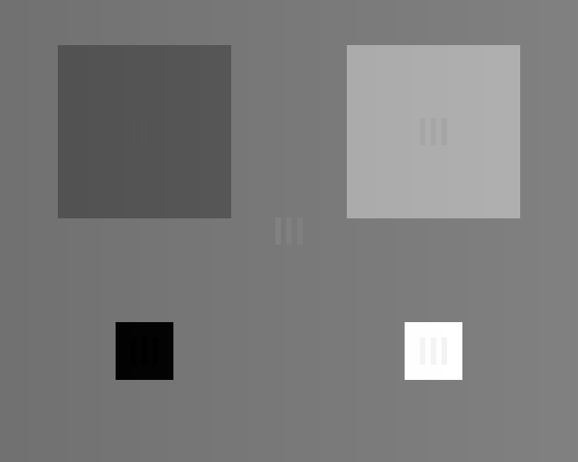
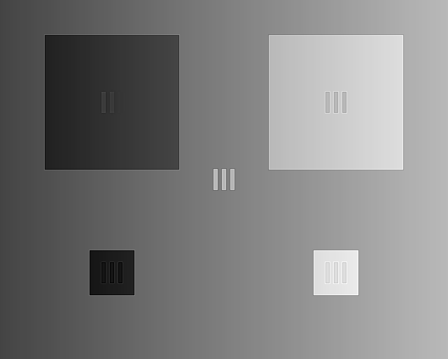

# 基于图像分解的高动态范围红外图像增强算法

[](https://www.python.org/downloads/)
[](https://opensource.org/licenses/MIT)
[](https://opencv.org/)

一个基于 Python 和 OpenCV 实现的红外图像增强项目，旨在解决高动态范围（12/14/16位）红外图像在8位显示设备上对比度低、细节不清晰的问题。

## 📖 问题背景

红外热成像捕捉的是物体表面的温度分布，其原始数据（通常为12-16位）包含了极宽的温度动态范围。然而，人眼和标准显示设备只能感知和展示有限的8位（256级）灰度。这导致原始红外图像直接显示时，往往呈现为一片灰蒙蒙的景象，目标与背景的温差细节被严重压缩，难以分辨。

本项目采用了一种基于 **“基础层-细节层”** 分解的增强策略，它能在有效压缩图像动态范围的同时，显著强化我们感兴趣的局部纹理和边缘细节。

## ⚙️ 算法核心原理

该增强算法遵循“分解 → 处理 → 融合”的三步策略：

```math
I_{original} \xrightarrow{分解} (I_{base}, I_{detail}) \xrightarrow{处理} (I'_{base}, I'_{detail}) \xrightarrow{融合} I_{enhanced}
```

1.  **图像分解 (Decomposition)**: 使用**双边滤波器 (Bilateral Filter)** 从原图 $I_{original}$ 中分离出代表大尺度、平缓变化的基础层 $I_{base}$，因为它能在平滑的同时保持边缘。随后，通过原图与平滑后的基础层相减，得到代表边缘和纹理的细节层 $I_{detail}$。
    $$I_{base} = \text{BilateralFilter}(I_{original})$$
    $$I_{detail} = I_{original} - \text{GaussianBlur}(I_{base})$$

2.  **分层处理 (Processing)**:
    * **基础层处理**: 对 $I_{base}$ 应用一种改进的**平台直方图均衡化**，有效压缩其宽动态范围，同时避免噪声的过度放大，得到 $I'_{base}$。
    * **细节层处理**: 对 $I_{detail}$ 进行带限幅的**非线性增益**，在强化有用细节的同时抑制潜在噪声，得到 $I'_{detail}$。

3.  **图像融合 (Fusion)**: 将处理后的两层相加，并通过归一化操作将像素值线性拉伸到 `[0, 255]` 区间，得到最终的8位增强图像 $I_{enhanced}$。
```math
I_{enhanced} = \text{Normalize}(\,I'_{base} + I'_{detail}\,)
```

## 📊 效果演示

为了直观展示算法效果，我们将直接线性拉伸的8位图与本算法处理后的8位图进行对比。（原始的16位TIF图像无法直接在此处显示，但已包含在 `images/` 目录下）。

| 直接线性拉伸 (Stretched 8-bit) | 本算法增强后 (Enhanced 8-bit) |
| :---------------------------------: | :----------------------------------: |
|     |   |

从对比中可以明显看出，增强后的图像无论是在场景的整体对比度，还是在云层、地物等局部细节的表现力上，都得到了显著提升。

## 🚀 如何运行

### 1. 环境准备

克隆本项目并安装所需的 Python 依赖包。

```bash
git clone [https://github.com/your-username/Infrared-Image-Enhancement.git](https://github.com/your-username/Infrared-Image-Enhancement.git)
cd Infrared-Image-Enhancement
pip install -r requirements.txt
```

### 2. 准备图像

将您的 **16位单通道 TIF 格式** 红外原图放入 `images/` 目录下。项目已包含一个名为 `original_16bit.tif` 的示例文件位置。

### 3. 执行增强脚本

运行 `enhance.py` 脚本来处理图像。您可以通过命令行参数指定输入和输出文件，这使得批处理和集成变得容易。

```bash
# 语法: python enhance.py -i <输入文件> -o <输出文件>

# 处理默认的示例图像
python enhance.py -i images/original_16bit.tif -o output/enhanced_result.png
```

处理完成后，您可以在 `output/` 文件夹中找到增强后的图像。

## 展望

本算法的效果依赖于若干关键参数，如双边滤波的 `sigmaColor`、`sigmaSpace`，以及细节裁剪的 `sigma_r` 等。在实际应用中，您可以：
* **参数调优**: 根据具体的成像设备、场景内容和应用需求进行仔细的调优。
* **自适应参数**: 进一步研究自适应的参数选择策略，使算法对不同场景更具鲁棒性。
* **算法融合**: 结合其他图像处理技术，如多尺度分解（小波变换）等，探索更优的增强效果。

## 📄 License

本项目采用 [MIT License](LICENSE) 开源。
