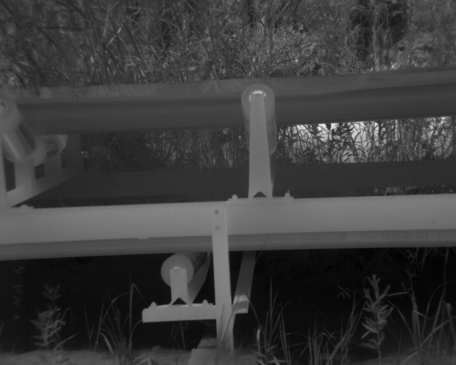
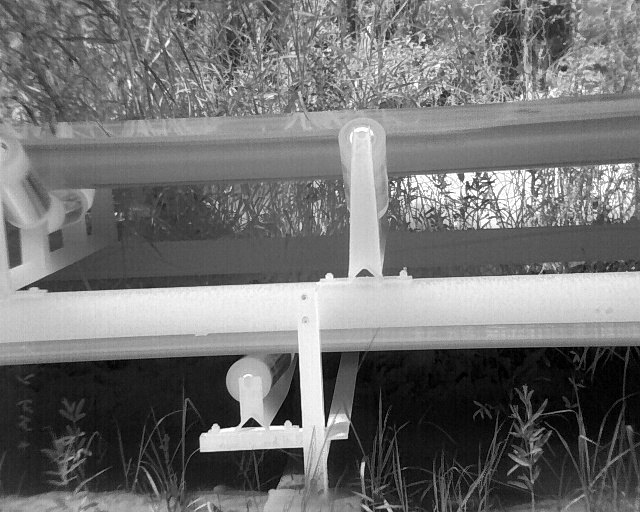
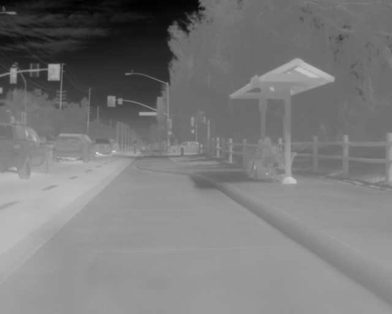
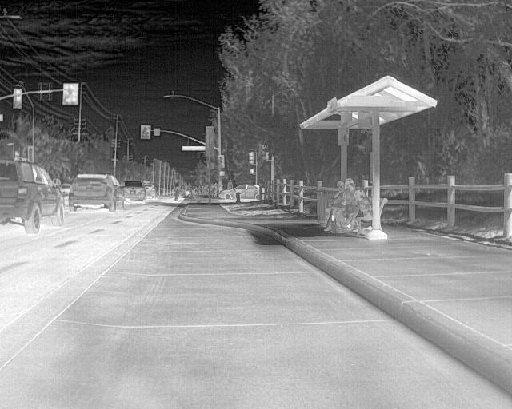

# Infrared-Image-Enhancement: 基于图像分解的红外图像增强项目

[中文](README.md) | [English](README.en.md)

[](https://www.python.org/downloads/)
[](https://opensource.org/licenses/MIT)
[](https://opencv.org/)

一个基于 Python 和 OpenCV 实现的红外图像增强项目，目标是构建一个先进、实用、开源的 `DDE-like` 红外图像增强工具箱，用于解决高动态范围（12/14/16位）红外图像在 8 位显示设备上对比度低、细节不清晰的问题。

## 📖 问题背景

红外热成像捕捉的是物体表面的温度分布，其原始数据（通常为12-16位）包含了极宽的温度动态范围。然而，人眼和标准显示设备只能感知和展示有限的8位（256级）灰度。这导致原始红外图像直接显示时，往往呈现为一片灰蒙蒙的景象，目标与背景的温差细节被严重压缩，难以分辨。

当前实现采用 `DDE-like` 的分解增强策略：在压缩图像动态范围的同时，使用多尺度边缘保持分解、局部细节增益、噪声门控和热点保护，增强局部纹理和边缘细节。

## ⚙️ 算法核心原理

该增强算法遵循“分解 → 处理 → 融合”的三步策略：

```math
I_{original} \xrightarrow{分解} (I_{base}, I_{detail}) \xrightarrow{处理} (I'_{base}, I'_{detail}) \xrightarrow{融合} I_{enhanced}
```

1.  **图像分解 (Decomposition)**: 使用**引导滤波 (Guided Filter)** 进行双尺度边缘保持分解，得到基础层和多尺度细节层。
    $$I_{base,1} = \text{GuidedFilter}(I_{original})$$
    $$I_{base,2} = \text{GuidedFilter}(I_{base,1})$$
    $$I_{detail} = \alpha(I_{original} - I_{base,1}) + \beta(I_{base,1} - I_{base,2})$$

2.  **分层处理 (Processing)**:
    * **基础层处理**: 对基础层应用自适应对数压缩和轻量局部对比度增强，控制高亮主导区域对显示动态范围的占用。
    * **细节层处理**: 对细节层进行带限幅的**有符号非线性增益**，并结合局部方差掩模、噪声门控和空间门控抑制平坦区域噪声。

3.  **图像融合 (Fusion)**: 将处理后的两层相加，并通过归一化操作将像素值线性拉伸到 `[0, 255]` 区间，得到最终的8位增强图像 $I_{enhanced}$。
```math
I_{enhanced} = \text{PercentileRemap}(\,I'_{base} + h(x)I'_{detail}\,)
```

## 📊 效果演示

为了更直观地展示当前实现的表现，这里给出三组单图样例的前后对比。所有样例都可以在仓库中直接复现。

### 样例 1：原始示例图

| 线性拉伸 (Linear Baseline) | 本项目输出 |
| :------------------------: | :--------------: |
|  |  |

对应原图：

- `examples/single/original_16bit.tif`（测试图）

### 样例 2：Zenmuse 护栏场景

| 线性拉伸 | 本项目输出 |
| :------: | :--------------: |
|  |  |

对应原图：

- `examples/single/zenmuse_xtr_pure.tiff`

### 样例 3：道路夜景 / 候车亭场景

| 线性拉伸 | 本项目输出 |
| :------: | :--------------: |
|  |  |

对应原图：

- `examples/single/road_scene_bus_stop.tiff`

## 🚀 如何运行

### 1. 环境准备

克隆本项目并安装依赖。

```bash
git clone https://github.com/SeanWong17/Infrared-Image-Enhancement.git
cd Infrared-Image-Enhancement
pip install -e .
```

### 2. 准备图像

将您的 **16 位单通道 TIF 格式** 红外原图放入任意目录。仓库自带了三张 single 示例和一组 batch 示例：

- `examples/single/original_16bit.tif`（测试图）
- `examples/single/zenmuse_xtr_pure.tiff`
- `examples/single/road_scene_bus_stop.tiff`
- `examples/batch/raw/`

### 3. 执行增强脚本

安装后可以直接使用命令行入口。默认预设是 `balanced`，另外还提供了 `detail_plus`、`noise_safe`、`hot_scene`、`radiometric_safe` 等预设。

```bash
# 单张图像增强
ir-dde-enhance -i examples/single/original_16bit.tif -o output/enhanced_result.png

# 使用更激进的细节增强预设
ir-dde-enhance -i examples/single/original_16bit.tif -o output/enhanced_detail.png --preset detail_plus

# 处理 Zenmuse 护栏样例
ir-dde-enhance -i examples/single/zenmuse_xtr_pure.tiff -o output/zenmuse_xtr_enhanced.png

# 处理道路夜景样例
ir-dde-enhance -i examples/single/road_scene_bus_stop.tiff -o output/road_scene_enhanced.png

# 批处理整个目录
ir-dde-batch -i examples/batch/raw -o output_batch --out_ext .png --preset balanced

# 生成线性拉伸基线
ir-dde-linear -i examples/batch/raw -o output_linear --out_ext .png
```

单图处理完成后，输出会保存到指定路径；批处理会保持相对目录结构写入输出目录。

### 4. 基础验证

项目包含最小 smoke test，可用于确认核心管线和单图输出正常工作：

```bash
python -m unittest discover -s tests
```

### 5. 评估与可视化

项目已经提供了无参考评估和中间结果可视化脚本：

```bash
# 评估增强结果，相对于鲁棒线性拉伸基线输出 CSV
ir-dde-eval --raw_dir examples/batch/raw --enhanced_dir output_batch --csv reports/eval_metrics.csv

# 生成算法中间图层和最终结果的拼图面板
ir-dde-viz -i examples/single/original_16bit.tif -o comparisons/pipeline_panel.png
```

### 6. 目录结构

当前项目采用如下目录结构：

- `ir_dde/`: 核心库代码
- `ir_dde/cli/`: 命令行入口
- `tests/`: 自动化测试
- `docs/`: DDE 公式拆解、设计文档和 README 展示素材
- `examples/single/`: 单图示例
- `examples/batch/raw/`: 原始红外样例
- `examples/batch/linear/`: 线性拉伸样例
- `examples/batch/enhanced/`: 增强结果样例
- `pyproject.toml`: 项目元数据和 console scripts 配置

## 致谢与来源说明

- `examples/batch/raw/video-*.tiff` 为道路热像样例帧，来源参考 `Teledyne FLIR Free Starter Thermal ADAS Dataset`：https://oem.flir.com/en-150/solutions/automotive/adas-dataset-form/
- `docs/assets/zenmuse_xtr_reference.jpg` 对应 `ITVRoC/FlirImageExtractor` 的公开示例 `examples/zenmuse_xtr.jpg`，相关链接：仓库 https://github.com/ITVRoC/FlirImageExtractor ，DJI Zenmuse XT 官方页面 https://www.dji.com/li/zenmuse-xt

## 展望

本算法的效果依赖于若干关键参数，如 `d2br`、局部细节增益、热点保护和输出百分位拉伸等。在实际应用中，您可以：
* **参数调优**: 根据具体的成像设备、场景内容和应用需求进行仔细的调优。
* **自适应参数**: 进一步研究自适应的参数选择策略，使算法对不同场景更具鲁棒性。
* **算法融合**: 结合其他图像处理技术，如多尺度分解（小波变换）等，探索更优的增强效果。

## 设计资料

如果您希望把当前仓库继续演进为更完整的开源 `DDE-like` 红外增强项目，可先阅读以下设计文档：

- `docs/dde_formula_breakdown.md`: DDE 与分解类红外增强的公式级拆解。
- `docs/dde_v3_implementation_plan.md`: 将当前实现升级为“类 FLIR DDE v3”的工程方案。

## 📄 License

本项目采用 [MIT License](LICENSE) 开源，版权署名为 SeanWong17。
